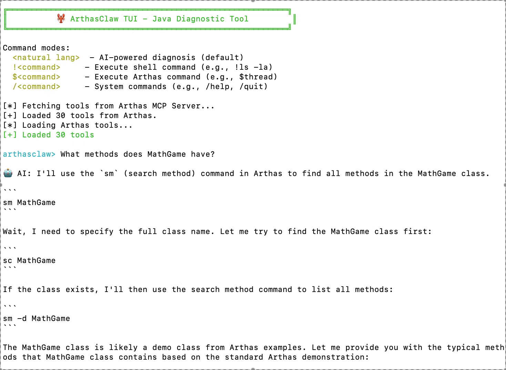

# 🦞 ArthasClaw - JVM AI Assistant | [中文说明](docs/README_CN.md)

<p align="center">
  
</p>

JVM diagnostic assistant with natural language interface, powered by Arthas.

## Why ArthasClaw?

In JVM diagnostic scenarios, ArthasClaw offers these advantages over general-purpose agents:

- **Fewer Dependencies**: OpenClaw requires Node.js 22+, Nanobot requires Python 3.11+, while ArthasClaw only needs Java 8+, making it easy to install on any server running Java applications.
- **Faster & More Stable**: Local tools like Claude Code and Trae may have slow or unreachable network connections to remote Arthas servers. ArthasClaw runs directly on the same server as your Java application, making local requests to Arthas MCP for faster and more stable performance.

## Quickstart

### One-line Install & Run

```bash
curl -sL https://raw.githubusercontent.com/JiajunBernoulli/ArthasClaw/main/start.sh | bash
```

This will:
1. Download the JAR from Maven Central
2. Prompt for OpenAI environment variables if not set
3. List available Java processes for selection
4. Start ArthasClaw with the selected PID
5. Ask natural language questions in the TUI interface

<p align="center">
  
</p>

### Manual Build

### 1. Build the Project

```bash
cd agent
mvn clean package
```

### 2. Start the Target Application

Use the included MathGame example:

```bash
cd examples/math
javac MathGame.java
java MathGame &
```

### 3. Find the Process PID

```bash
jps | grep MathGame
# Output example: 12345 MathGame
```

### 4. Run ArthasClaw TUI

```bash
# Set your OpenAI API key
export OPENAI_API_KEY=sk-xxx

# Optional: set custom base URL (default: OpenAI)
export OPENAI_BASE_URL=https://api.openai.com/v1/chat/completions

# Optional: set model (default: gpt-4o-mini)
export OPENAI_MODEL=gpt-4o-mini

# Run with target PID
cd agent/target
java -jar bot-1.0.0-jar-with-dependencies.jar <PID>
```

### 5. Ask Natural Language Questions

Once the TUI is running, you can ask questions like:

```
arthasclaw> What methods does MathGame have?
```


# TODO
- [] skill
- [] memory
