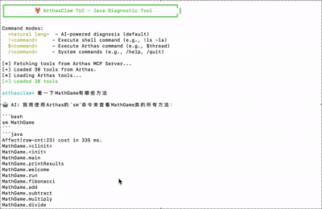

# 🦞 ArthasClaw - JVM AI Assistant

<p align="center">
  
</p>

JVM 诊断助手，基于 Arthas 的自然语言诊断工具。

## 优点

在JVM诊断场景下，ArthasClaw相比通用Agent有以下优点：
- **依赖少**：OpenClaw需要Node22+版本，Nanobot需要Python3.11+版本，而ArthasClaw只需Java8+版本，能一键安装在任何Java应用的服务器中。
- **速度快**： 本地的Claude Code、Trae等工具与远程服务器的Arthas通信网络可能较慢，甚至不可达。而ArthasClaw可以直接运行在Java应用所在的服务器中，从本地直接请求Arthas MCP，速度更快、稳定性更高。

## 快速开始

### 一键安装启动

```bash
curl -sL https://raw.githubusercontent.com/JiajunBernoulli/ArthasClaw/main/start.sh | sh
```

脚本会自动：
1. 从 Maven Central 下载 JAR
2. 检查 OpenAI 环境变量，缺失时提示输入
3. 列出可选的 Java 进程供选择
4. 启动 ArthasClaw 并连接目标进程
5. 在 TUI 界面中输入自然语言问题

<p align="center">
  
</p>

## ⚠️ 技能管理（实验性）

技能（Skill）是可复用的提示词模板，用于增强 AI 在特定诊断场景下的能力。你可以安装、列出、查看和删除技能。

### 技能命令

```
/skill install <url|path>   从 URL 或本地文件安装技能
/skill list                 列出已安装的技能
/skill show <name>          查看技能详情
/skill remove <name>        删除技能
```

### 技能文件格式

技能文件支持 YAML front matter 格式：

```yaml
---
name: deadlock-analyzer
description: 检测和分析线程死锁
version: 1.0.0
author: your-name
tools:
  - thread
  - thread -b
  - stack
---
你是一个 Java 线程死锁分析专家。
分析线程问题时：
1. 使用 `thread -b` 查找阻塞线程
2. 使用 `thread` 查看整体线程状态
3. 提供可操作的解决方案
```

### 示例：死锁检测

1. **启动死锁演示程序**：
   ```bash
   cd examples/deadlock
   javac -d . DeadlockDemo.java
   java -cp . io.github.jiajunbernoulli.arthasclaw.examples.DeadlockDemo
   ```

2. **安装死锁分析技能**：
   ```
   arthasclaw> /skill install examples/deadlock/deadlock-analyzer.md
   [+] Skill installed: deadlock-analyzer v1.0.0
       Description: Detect and analyze thread deadlocks
   ```

3. **让 AI 分析死锁**：
   ```
   arthasclaw> 检查线程死锁
   ```

AI 将自动应用技能中的分析流程，使用指定的 Arthas 工具进行诊断。

### 技能存储

技能存储在 `~/.arthasclaw/skills/` 目录下。你也可以从 URL 安装技能：

```
arthasclaw> /skill install https://raw.githubusercontent.com/JiajunBernoulli/ArthasClaw/main/skills/deadlock-analyzer.md
```
